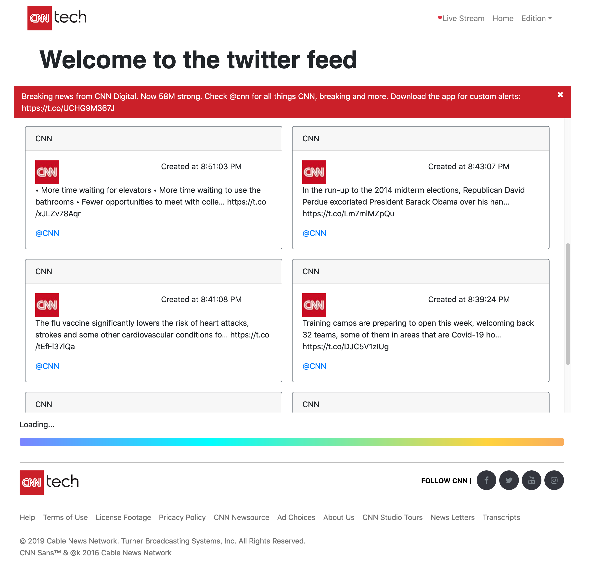
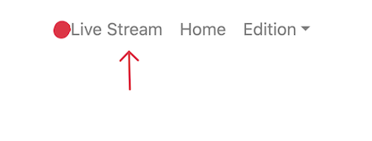

## ✨Description

- This Application is a simple realtime Twitter renderer web application.
   


- When you first visit the Home page `( http://localhost:3000/ )` the application renders realtime CNN’s Twitter timeline. 
   - when starting the application you will be redirected to the home page, this will display the latest Tweets made by a specific user in this case `CNN`
   - the page is structured to render a container displaying the recent tweets, and implenting `infite scroll functionality`, loading `10` tweets at a time thinking primarliy in User Experience and preformance. 

- There is a second page build within the application under the `Live Stream` option in the navigatin bar
   

- live stream option is a page that will continously pull tweets with a specific fillter. 
   - this page leverages the use of web sockets to create a steram of data comunicating with tweeter's api using `socketio`

## 🚀 Usage

Make sure you have node installed `10.2.0+` and yarn installed or npm.

1. Clone this repo 
   - open your terminal run `git clone https://github.com/ivansito87/nn_c0de_challeng3.git`

2. cd into `cd nn_c0de_challeng3` and run `yarn` or if you prefer using npm run `npm install`

3. create `.env` file to the root project directory with the following keys:
   - add the folowing keys
```shell
   TWITTER_CONSUMER_KEY=<consumer_key>
   TWITTER_CONSUMER_SECRET=<consumer_secret>
   TWITTER_ACCESS_TOKEN_KEY=<access_token>
   TWITTER_ACCESS_TOKEN_SECRET=<access_secret>
```
3. In a terminal window `cd src/server` and run:
   #### `node server.js`

4. Open a new terminal window and run:
   #### `yarn start` or `npm start`
   Runs the app in the development mode.<br>
   Open [http://localhost:3000](http://localhost:3000) to view the Tweet CNN Application in the browser.

## Available Scripts
to test run 
#### `yarn test`
npm 

The page will reload if you make edits.<br>
### `npm test`

Launches the test runner in the interactive watch mode.<br>
See the section about [running tests](#running-tests) for more information.

### `npm run build`

Builds the app for production to the `build` folder.<br>
It correctly bundles React in production mode and optimizes the build for the best performance.

The build is minified and the filenames include the hashes.<br>
Your app is ready to be deployed!
